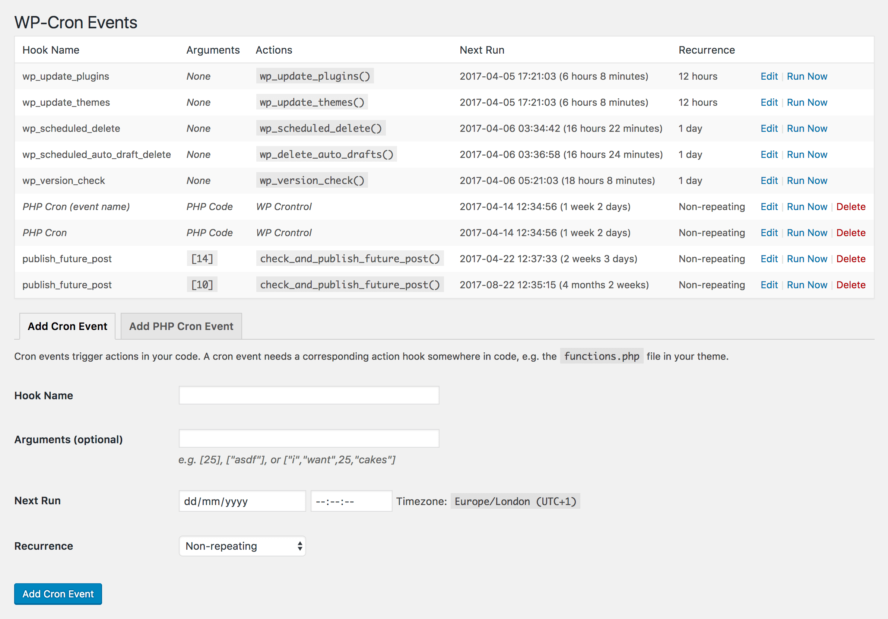
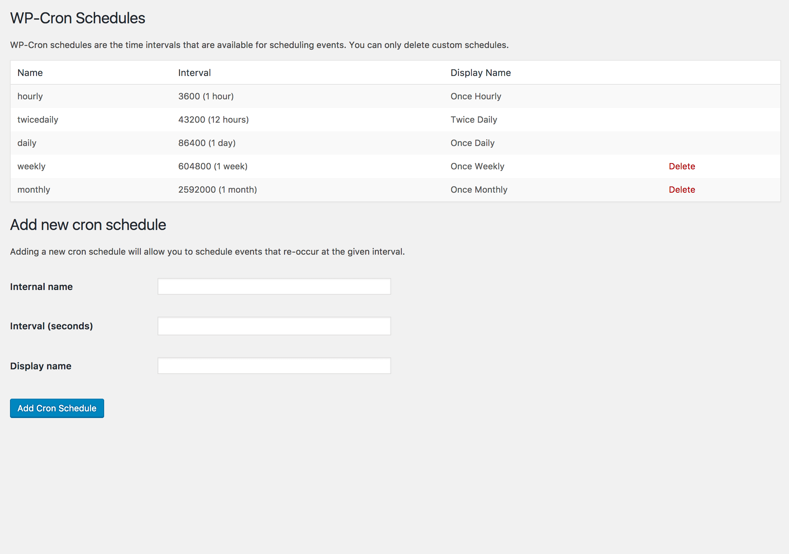
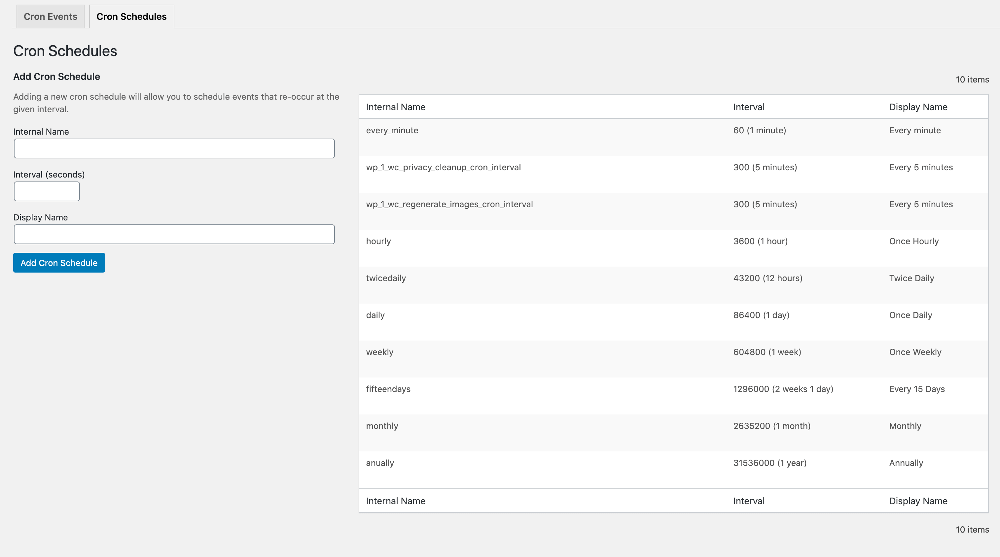

# WP Crontrol

Contributors: johnbillion, scompt  
Tags: cron, wp-cron, crontrol, debug  
Requires at least: 4.2  
Tested up to: 6.1  
Stable tag: 1.15.0  
Requires PHP: 5.6  
Donate link: https://github.com/sponsors/johnbillion

WP Crontrol enables you to view and control what's happening in the WP-Cron system.

## Description

WP Crontrol enables you to view and control what's happening in the WP-Cron system. From the admin screens you can:

 * View all cron events along with their arguments, recurrence, callback functions, and when they are next due.
 * Edit, delete, pause, resume, and immediately run cron events.
 * Add new cron events.
 * Bulk delete cron events.
 * Add and remove custom cron schedules.
 * Export and download cron event lists as a CSV file.

WP Crontrol is aware of timezones, will alert you to events that have no actions or that have missed their schedule, and will show you a helpful warning message if it detects any problems with your cron system.

### Usage

1. Go to the `Tools → Cron Events` menu to manage cron events.
2. Go to the `Settings → Cron Schedules` menu to manage cron schedules.

### Other Plugins

I maintain several other plugins for developers. Check them out:

* [Query Monitor](https://wordpress.org/plugins/query-monitor/) is the developer tools panel for WordPress.
* [User Switching](https://wordpress.org/plugins/user-switching/) provides instant switching between user accounts in WordPress.

## Frequently Asked Questions

### Does this plugin work with PHP 8?

Yes, it's actively tested and working up to PHP 8.1.

### I get the error "There was a problem spawning a call to the WP-Cron system on your site". How do I fix this?

[You can read all about problems spawning WP-Cron here](https://github.com/johnbillion/wp-crontrol/wiki/Problems-with-spawning-a-call-to-the-WP-Cron-system).

### Why do some cron events miss their schedule?

[You can read all about cron events that miss their schedule here](https://github.com/johnbillion/wp-crontrol/wiki/Cron-events-that-have-missed-their-schedule).

### Why do some cron events reappear shortly after I delete them?

If the event is added by a plugin then the plugin most likely rescheduled the event as soon as it saw that the event was missing. To get around this you can instead use the "Pause" option for the event which means it'll remain in place but won't perform any action when it runs.

### Is it safe to delete cron events?

This depends entirely on the event. You can use your favourite search engine to search for the event name in order to find out which plugin it belongs to, and then decide whether or not to delete it.

If the event shows "None" as its action then it's usually safe to delete. Please see the other FAQs for more information about events with no action.

### Why can't I delete some cron events?

The WordPress core software uses cron events for some of its functionality and removing these events is not possible because WordPress would immediately reschedule them if you did delete them. For this reason, WP Crontrol doesn't let you delete these persistent events from WordPress core in the first place.

If you don't want these events to run, you can "Pause" them instead.

### What happens when I pause an event?

Pausing an event will disable all actions attached to the event's hook. The event itself will remain in place and will run according to its schedule, but all actions attached to its hook will be disabled. This renders the event inoperative but keeps it scheduled so as to remain fully compatible with events which would otherwise get automatically rescheduled when they're missing.

As pausing an event actually pauses its hook, all events that use the same hook will be paused or resumed when pausing and resuming an event. This is much more useful and reliable than pausing individual events separately.

### What happens when I resume an event?

Resuming an event re-enables all actions attached to the event's hook. All events that use the same hook will be resumed.

### What does it mean when "None" is shown for the Action of a cron event?

This means the cron event is scheduled to run at the specified time but there is no corresponding functionality that will be triggered when the event runs, therefore the event is useless.

This is often caused by plugins that don't clean up their cron events when you deactivate them. You can use your favourite search engine to search for the event name in order to find out which plugin it belongs to, and then decide whether or not to delete it.

### How do I change the next run time or the recurrence of a cron event?

You can change the time and recurrence of a cron event by clicking the "Edit" link next to the event.

### How can I create a cron event that requests a URL?

From the Tools → Cron Events → Add New screen, create a PHP cron event that includes PHP that fetches the URL using the WordPress HTTP API. For example:

	wp_remote_get( 'http://example.com' );

Please see the "Which users can manage PHP cron events?" FAQ for information about which users can create PHP cron events.

### Why do changes that I make to some cron events not get saved?

[You can read all about problems with editing cron events here](https://github.com/johnbillion/wp-crontrol/wiki/Problems-adding-or-editing-WP-Cron-events).

### Can I export a list of cron events?

Yes, a CSV file of the event list can be exported and downloaded via the "Export" button on the cron event listing screen. This file can be opened in any spreadsheet application.

### Can I see a historical log of all the cron events that ran on my site?

Not yet, but I hope to add this functionality soon.

### Can I see a historical log of edits, additions, and deletions of cron events and schedules?

Yes. The excellent <a href="https://wordpress.org/plugins/simple-history/">Simple History plugin</a> has built-in support for logging actions performed via WP Crontrol.

### What's the use of adding new cron schedules?

Cron schedules are used by WordPress and plugins for scheduling events to be executed at regular intervals. Intervals must be provided by the WordPress core or a plugin in order to be used. As an example, many backup plugins provide support for periodic backups. In order to do a weekly backup, a weekly cron schedule must be entered into WP Crontrol first and then a backup plugin can take advantage of it as an interval.

### How do I create a new cron event?

There are two steps to getting a functioning cron event that executes regularly. The first step is telling WordPress about the hook. This is the part that WP Crontrol was created to provide. The second step is calling a function when your hook is executed.

*Step One: Adding the hook*

In the Tools → Cron Events admin panel, click on "Add New" and enter the details of the hook. You're best off using a hook name that conforms to normal PHP variable naming conventions. The event schedule is how often your hook will be executed. If you don't see a good interval, then add one in the Settings → Cron Schedules admin panel.

*Step Two: Writing the function*

This part takes place in PHP code (for example, in the `functions.php` file from your theme). To execute your hook, WordPress runs an action. For this reason, we need to tell WordPress which function to execute when this action is run. The following line accomplishes that:

	add_action( 'my_hookname', 'my_function' );

The next step is to write your function. Here's a simple example:

	function my_function() {
		wp_mail( 'hello@example.com', 'WP Crontrol', 'WP Crontrol rocks!' );
	}

### How do I create a new PHP cron event?

In the Tools → Cron Events admin panel, click on "Add New". In the form that appears, select "PHP Cron Event" and enter the schedule and next run time. The event schedule is how often your event will be executed. If you don't see a good interval, then add one in the Settings → Cron Schedules admin panel. In the "Hook code" area, enter the PHP code that should be run when your cron event is executed. You don't need to provide the PHP opening tag (`<?php`).

Please see the "Which users can manage PHP cron events?" FAQ for information about which users can create PHP cron events.

### Which users can manage cron events and schedules?

Only users with the `manage_options` capability can manage cron events and schedules. By default, only Administrators have this capability.

### Which users can manage PHP cron events? Is this dangerous?

Only users with the `edit_files` capability can manage PHP cron events. This means if a user cannot edit files on the site (eg. through the Plugin Editor or Theme Editor) then they cannot edit or add a PHP cron event. By default, only Administrators have this capability, and with Multisite enabled only Super Admins have this capability.

If file editing has been disabled via the `DISALLOW_FILE_MODS` or `DISALLOW_FILE_EDIT` configuration constants then no user will have the `edit_files` capability, which means editing or adding a PHP cron event will not be permitted.

Therefore, the user access level required to execute arbitrary PHP code does not change with WP Crontrol activated.

### Are any WP-CLI commands available?

The cron commands which were previously included in WP Crontrol are now part of WP-CLI itself. See `wp help cron` for more info.

### Who took the photo in the plugin header image?

The photo was taken by <a href="https://www.flickr.com/photos/michaelpardo/21453119315">Michael Pardo</a> and is in the public domain.

## Screenshots

1. Cron events can be modified, deleted, and executed 

2. New cron events can be added 

3. New cron schedules can be added, giving plugin developers more options when scheduling events 

<!-- changelog -->
