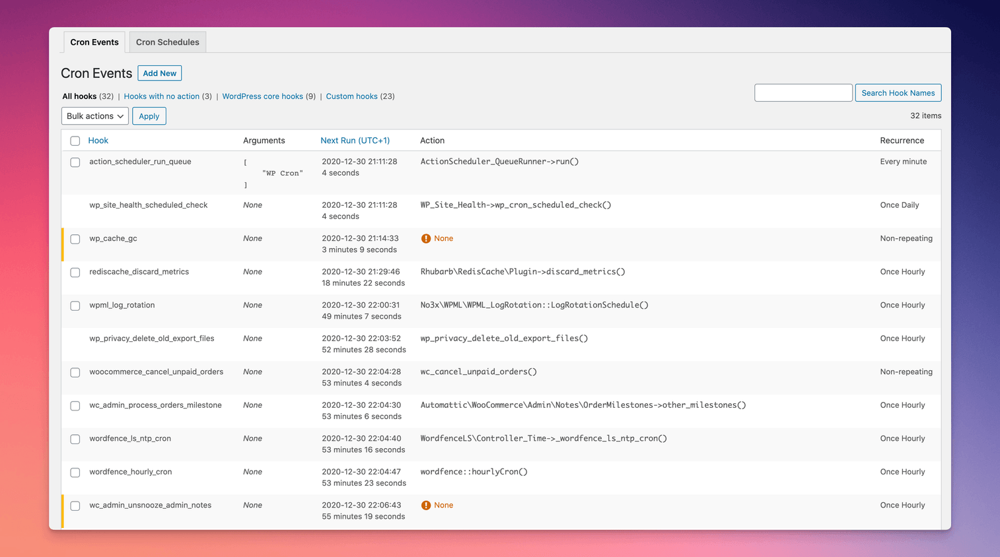
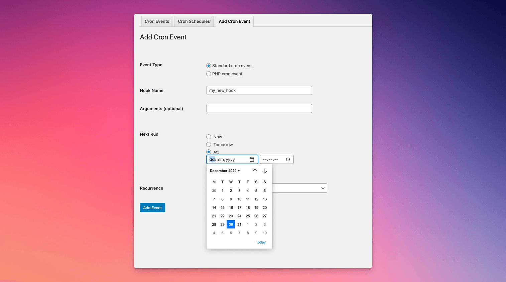
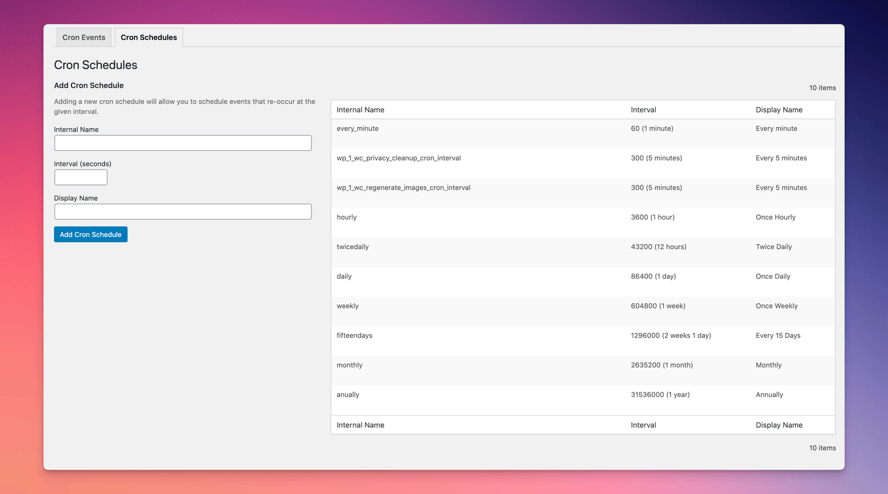

# WP Crontrol

WP Crontrol enables you to take control of the scheduled cron events on your WordPress website or WooCommerce store. From the admin screens you can:

 * View all scheduled cron events along with their arguments, schedule, callback functions, and when they are next due.
 * Edit, delete, pause, resume, and immediately run cron events.
 * Add new cron events.
 * Bulk delete cron events.
 * Add and remove custom cron schedules.
 * Export and download cron event lists as a CSV file.

WP Crontrol is aware of timezones, will alert you to events that have no actions or that have missed their schedule, and will show you a helpful warning message if it detects any problems with your cron system.

## Usage

1. Go to the `Tools → Cron Events` menu to manage cron events.
2. Go to the `Settings → Cron Schedules` menu to manage cron schedules.

## Documentation

[Extensive documentation on how to use WP Crontrol and how to get help for error messages that it shows is available on the WP Crontrol website](https://wp-crontrol.com/docs/how-to-use/).

## Frequently Asked Questions

[See the FAQ on the WordPress.org plugin page for WP Crontrol](https://wordpress.org/plugins/wp-crontrol/#faq).

## Other Plugins

I maintain several other plugins for developers. Check them out:

* [Query Monitor](https://wordpress.org/plugins/query-monitor/) is the developer tools panel for WordPress.
* [User Switching](https://wordpress.org/plugins/user-switching/) provides instant switching between user accounts in WordPress.

## Privacy Statement

WP Crontrol is private by default and always will be. It does not send data to any third party, nor does it include any third party resources. [WP Crontrol's full privacy statement can be found here](https://wp-crontrol.com/privacy/).

## Accessibility Statement

WP Crontrol aims to be fully accessible to all of its users. [WP Crontrol's full accessibility statement can be found here](https://wp-crontrol.com/accessibility/).

## Sponsors

The time that I spend maintaining this plugin and others is in part sponsored by:

Plus all my kind sponsors on GitHub:

<a href="https://github.com/sponsors/johnbillion">

<a href="https://github.com/sponsors/johnbillion">Click here to find out about supporting my open source tools and plugins</a>.

## Screenshots

1. Cron events can be modified, deleted, and executed 

2. New cron events can be added 

3. New cron schedules can be added, giving plugin developers more options when scheduling events 
